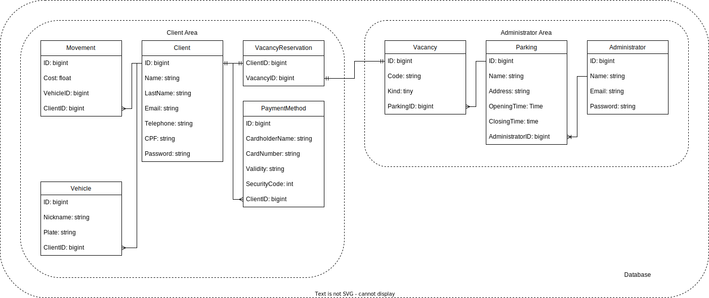

# Administrator API

This README would normally document whatever steps are necessary to get the
application up and running.

# Estrutura do banco de dados

    

# Tabelas

## Tabela "vacancies"

Esta tabela representa as vagas de estacionamento registradas na aplicação. Possui os seguintes campos:

- code: campo de texto que armazena o código identificador da vaga de estacionamento.
- kind: campo numérico inteiro que representa o tipo de vaga.
- parking_id: campo numérico inteiro de identificação do estacionamento ao qual a vaga pertence.
- created_at: campo de data e hora que registra o momento em que o registro da vaga foi criado.
- updated_at: campo de data e hora que registra o momento em que o registro da vaga foi atualizado.

## Tabela "parkings"

Esta tabela representa os estacionamentos registrados na aplicação. Possui os seguintes campos:

- name: campo de texto que armazena o nome do estacionamento.
- address: campo de texto que armazena o endereço do estacionamento.
- opening_time: campo de tempo que registra o horário de abertura do estacionamento.
- closing_time: campo de tempo que registra o horário de fechamento do estacionamento.
- administrator_id: campo numérico inteiro de identificação do administrador responsável pelo estacionamento.
- created_at: campo de data e hora que registra o momento em que o registro do estacionamento foi criado.
- updated_at: campo de data e hora que registra o momento em que o registro do estacionamento foi atualizado.

## Tabela "movements"

Esta tabela representa as movimentações de veículos registradas na aplicação. Possui os seguintes campos:

- cost: campo numérico de ponto flutuante que armazena o custo da movimentação do veículo.
- vehicle_id: campo numérico inteiro de identificação do veículo associado à movimentação.
- client_id: campo numérico inteiro de identificação do cliente associado à movimentação.
- created_at: campo de data e hora que registra o momento em que o registro da movimentação foi criado.
- updated_at: campo de data e hora que registra o momento em que o registro da movimentação foi atualizado.

## Tabela "administrators"

Esta tabela representa os administradores da aplicação. Possui os seguintes campos:

- email: campo de texto que armazena o endereço de e-mail do administrador.
- encrypted_password: campo de texto que armazena a senha do administrador criptografada.
- reset_password_token: campo de texto utilizado para armazenar o token de redefinição de senha, caso seja solicitado.
- reset_password_sent_at: campo de data e hora que registra o momento em que o token de redefinição de senha foi enviado.
- remember_created_at: campo de data e hora que registra o momento em que o administrador efetuou o login e selecionou a opção "lembrar de mim".
- created_at: campo de data e hora que registra o momento em que o registro foi criado.
- updated_at: campo de data e hora que registra o momento em que o registro foi atualizado.
- name: campo de texto que armazena o nome do administrador.
- jti: campo de texto utilizado para armazenar o JSON Web Token (JWT) do administrador.
